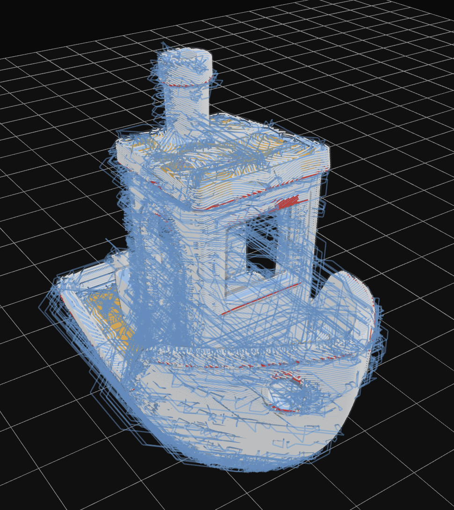

# Manifold



A non-planar slicer for 3D printers: turns a mesh into Gcode using
toolpaths that deform off the flat XY plane, rather than strictly planar
layers.

## Crates

- `crates/manifold-core` — the slicing engine (mesh → layers → toolpaths →
  Gcode). No UI dependencies; usable headless or embedded.
- `crates/manifold-fidget` — geometry backend for SDF evaluation, narrow-band
  Fast Marching Eikonal solvers, NanoVDB grids, and GPU compute pipelines.
- `crates/manifold-cli` — CLI front-end (`manifold`) for headless/batch use.
- `crates/manifold-gui` — desktop GUI (egui + wgpu) for interactive use.

## Documentation

Complete documentation is available in the [`docs/`](docs/index.md) directory:

- [Getting Started](docs/getting-started.md) — System requirements, build instructions, and quickstart workflows.
- [CLI Reference](docs/cli.md) — Command line options, multi-tool syntax, and batch scripting.
- [GUI User Guide](docs/gui/index.md) — Viewport navigation, settings panel, data views, and custom G-code macros.
- [Configuration & Profile Reference](docs/configuration/index.md) — Full reference for all parameters in `profile.json`.

## Building

```sh
cargo build --workspace
```

## Running

```sh
cargo run -p manifold-cli -- path/to/model.stl -o out.gcode
cargo run -p manifold-gui
```

For real/complex meshes, build and run in release mode — the debug
profile can be many times slower for this CPU-heavy geometry pipeline
(polygon offsetting, Eikonal fast-marching, parallel toolpath planning),
which can look like a hang rather than a slow slice:

```sh
cargo run --release -p manifold-cli -- path/to/model.stl -o out.gcode
cargo run --release -p manifold-gui
```

### macOS Application Bundle

To build a standalone `Manifold.app` bundle locally on macOS (so it launches directly from Finder/Dock without opening a Terminal window):

```sh
./scripts/build-macos-app.sh            # Builds target/release/Manifold.app
./scripts/build-macos-app.sh --open     # Builds and launches Manifold.app
./scripts/build-macos-app.sh --zip      # Packages target/release/Manifold-macos-app.zip
```

### Automation (dev only)

`manifold-gui` can optionally expose a local MCP automation server for
driving the GUI programmatically (agent/test harnesses) — see
`ROADMAP.md` Phase 9. Off by default; enable with:

```sh
cargo run -p manifold-gui --features mcp-server
```

Listens on `127.0.0.1:8931`. Never enable this feature in a release
build.

See `ARCHITECTURE.md` and `CODE_STYLE.md` for more detail.
