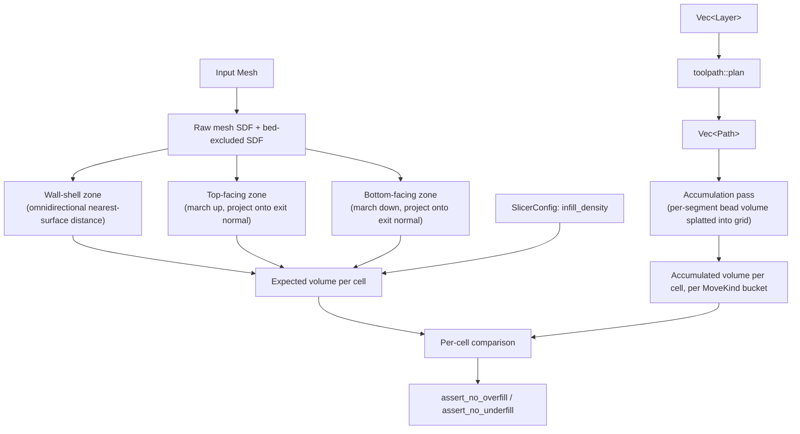

# Extrusion Volume Audit — Design

## Status: Approved design, ready for implementation planning

## Background

Backlog item (recorded in `docs/superpowers/specs/2026-09-17-perpendicular-top-distance-and-wall-overlap-design.md`,
"Plan D"): there is currently no way, in code, to measure how much
extrusion actually lands where a print is produced. This has let real
bugs slip past the test suite — near-duplicate extrusion around small
top surfaces and empty voids near the bed, both observed anecdotally at
per-cell extrusion-to-expected-volume ratios above 2x on some real
prints. The Task 3/4 wall/solid-fill duplication bug fixed in the
`2026-09-17-perpendicular-top-distance-and-wall-overlap` plan is exactly
this class of bug, caught by human review of a printed part, not by any
automated check.

This design builds the tool that would have caught it, and generalizes
it: a way to accumulate actual extruded volume into a coarse 3D grid,
compute an independent expected volume for the same grid, and compare —
both as a `#[test]`-usable assertion API (this plan's scope) and,
later, as an interactive GUI visualization (explicitly deferred, tracked
as a follow-up).

## Design Goal, Stated Precisely

Catch **layer-to-layer consistency bugs in the slicing pipeline itself**,
not just bugs in how already-sliced layers get turned into toolpaths.
This constrains the design in one specific, load-bearing way (see next
section).

## The Central Design Constraint: Independent Ground Truth

An earlier draft of this design proposed computing "expected volume" from
`Layer::solid_fill_boundary`/`Layer::infill_boundary` — the slicer's own
already-computed classification of which regions should be solid vs.
sparse. **This was rejected.** Those fields are themselves outputs of the
layering pipeline this audit exists to check. A bug in that pipeline
(exactly the class of bug this plan targets) would corrupt both the
actual printed geometry *and* the "expected" baseline identically,
canceling out — the audit would pass while the pipeline is wrong.

**Expected volume must be computed from the raw input mesh only**, via a
small, self-contained reimplementation of the relevant geometric
concepts — not by calling into `order_field::TopSurfaceAwareOrderField`,
`slicing::compute_solid_fill_boundaries`, or any other production
slicing code. This is deliberate: the production implementation of
"distance to a top surface" is complex (order-field abstraction, apex/
axis resolution, march-bound optimization, five-point disambiguation —
several rounds of real bugs were found and fixed in it across the prior
plan). A fresh, independent, much simpler reimplementation of the same
underlying geometric idea is what makes this audit capable of catching a
production bug rather than sharing it.

## Architecture

Three independent zone classifiers, each grounded directly in the raw
mesh SDF, decide the expected fill fraction at any point in space. A
separate accumulation pass sums actual extruded volume from the planned
`Path`/`Segment` list into the same grid. The two are compared per cell.



## Components

### Grid

One global 3D voxel grid in world space, bounds derived from the sliced
object(s)' combined bounding box (padded by one `cell_size`). Segments
already carry real world-space 3D positions (`Path::points`), so this
needs no layer-bucketing or order-field awareness on the accumulation
side — a segment's actual physical position (including deliberate
non-nominal-layer deviations like wave/overhang/scarf-joint segments) is
what lands in the grid, which is a strictly more honest signal than
bucketing by a segment's *nominal* source layer.

```rust
pub struct VolumeAuditGrid {
    pub origin: DVec3,
    pub cell_size: f64,
    pub dims: [usize; 3],
    /// mm^3 accumulated per cell, one flattened Vec per bucket.
    pub accumulated: HashMap<VolumeKindBucket, Vec<f64>>,
    /// mm^3 expected per cell (independent of `accumulated`).
    pub expected: Vec<f64>,
}

#[derive(Debug, Clone, Copy, PartialEq, Eq, Hash)]
pub enum VolumeKindBucket {
    Wall,
    TopSurface,
    Infill,
    Overhang,
}
```

`Wall` = `MoveKind::WallOuter` + `MoveKind::WallInner`. `Infill` =
`MoveKind::Infill` + `MoveKind::Bridge`. `TopSurface` and `Overhang` map
1:1 to their `MoveKind` variants. `Travel`/`Wipe`/`DebugExcluded` are
excluded (zero or non-physical extrusion).

### Expected-volume classification (per cell, raw-SDF-grounded)

Three independent primitives, each a small function operating only on a
`MeshSdf`:

1. **Wall-shell zone** — `mesh_sdf.sample(p).value.abs() <=
   wall_count * wall_line_width + wall_offset`. Omnidirectional nearest-
   surface distance; direction-agnostic because walls form a shell
   uniformly around the whole perimeter regardless of vertical position.

2. **Top-facing zone** — march straight up (`+BUILD_DIRECTION`) from `p`
   in small steps against a bed-excluded `MeshSdf` (reusing
   `crate::mesh::non_bed_floor_faces` — a geometric face-filter utility,
   not a computed slicing output, so reusing it doesn't reintroduce the
   circularity this design rejects) until exiting the solid; project the
   accumulated distance onto the exit sample's gradient (its outward
   surface normal), exactly the perpendicular-distance idea from the
   `TopSurfaceAwareOrderField` fix — but as a fresh ~15-line function
   using only `MeshSdf::sample`, with none of the `OrderField`
   abstraction, `max_search` bound optimization, or five-point
   disambiguation the production code carries. Within
   `top_layers * layer_height`: wall-shell-equivalent (100% solid).

3. **Bottom-facing zone** — the mirror of (2): march straight down
   (`-BUILD_DIRECTION`) against the *full, unexcluded* mesh SDF (we want
   this to detect the literal bed, an internal cavity floor, or the
   underside of a bridge/overhang uniformly — all are "downward-facing
   surface" in the same sense). Within `bottom_layers * layer_height`:
   100% solid.

Top and bottom need the directional march specifically because "what's
directly above/below in the build direction" is where a layer-to-layer
relationship lives — that's a genuinely different question from "what's
nearby in any direction" (the wall-shell test), and it's exactly the
kind of thing a coordinate check (e.g. `p.z - bed_z` for "near the bed")
would get wrong for an overhang, bridge, or internal cavity: nearby
solid material to the side or above doesn't mean there's support below.

If none of the three zones apply (and the point is inside the mesh):
expected fraction = `config.infill_density`. Outside the mesh entirely:
expected = 0 — any accumulated volume there is extrusion into open air,
a defect regardless of everything else in this design.

```rust
fn wall_shell_zone(mesh_sdf: &MeshSdf, p: DVec3, threshold: f64) -> bool;
fn top_facing_distance(bed_excluded_sdf: &MeshSdf, p: DVec3, step: f64, max_search: f64) -> Option<f64>;
fn bottom_facing_distance(full_sdf: &MeshSdf, p: DVec3, step: f64, max_search: f64) -> Option<f64>;

fn expected_fill_fraction(
    mesh_sdf: &MeshSdf,
    bed_excluded_sdf: &MeshSdf,
    p: DVec3,
    config: &SlicerConfig,
) -> f64;
```

`expected_fill_fraction` is sampled once at each cell's center (v1 —
sub-cell partial-coverage sampling is a documented, deferred refinement,
not required for this to catch the bug class it targets).

### Accumulation (actual extruded volume)

For every extruding `Segment` in every `Path` (skip
`Travel`/`Wipe`/`DebugExcluded`), its bead volume is
`segment.extrusion_length * filament_cross_section_area(filament_diameter)`
(already exactly conserved by construction — see
`extrusion::segment_extrusion_length`'s own doc comment). Splat that
volume along the segment's world-space geometry into the grid: step
along the segment at `cell_size / 4` intervals, add
`bead_volume * (step_length / segment_length)` to the cell containing
each sample point, into the bucket matching `segment.kind`. Step-sampling
(not exact geometric cell-overlap-fraction weighting) is the deliberate
v1 choice — simpler, consistent with this codebase's existing march-style
stepping (`march_to_top` and friends), and adequate for a "moderately
coarse" diagnostic grid; exact weighting is a documented, deferred
refinement if step-sampling proves too coarse in practice.

```rust
pub fn audit_extrusion_volume(
    mesh: &Mesh,
    paths: &[Path],
    config: &SlicerConfig,
    cell_size: f64,
) -> VolumeAuditGrid;
```

Note the signature takes `mesh` directly (not `Vec<Layer>`) — expected
volume needs only the raw mesh + config, and accumulation needs only
`paths`; `Layer` never enters this computation, which is the point.

### Query / assertion API

```rust
impl VolumeAuditGrid {
    /// (cell index, ratio) for every cell where accumulated volume
    /// (summed across all buckets) exceeds `expected * max_ratio`.
    pub fn overfilled_cells(&self, max_ratio: f64) -> Vec<([usize; 3], f64)>;
    /// (cell index, fraction) for every cell where accumulated volume
    /// (summed across all buckets) is below `expected * min_fraction`,
    /// among cells with `expected > 0`.
    pub fn underfilled_cells(&self, min_fraction: f64) -> Vec<([usize; 3], f64)>;
    /// Panics with the worst offending cell's index, ratio, and world
    /// position if any cell exceeds `max_ratio`. Direct #[test] use.
    pub fn assert_no_overfill(&self, max_ratio: f64);
    pub fn assert_no_underfill(&self, min_fraction: f64);
}
```

## Global Constraints

- Core geometry uses `glam::DVec3` (f64) — no `f32`/`Vec3`, consistent
  with the rest of `manifold-core`.
- Expected-volume computation depends only on the raw input `Mesh` and
  `SlicerConfig` — never on `Layer`, `WallLoop`, `solid_fill_boundary`,
  `infill_boundary`, or any `OrderField`/axis/apex resolution. This is
  the load-bearing constraint the whole design exists to satisfy; a
  future maintainer must not "simplify" this by reusing the production
  boundaries.
- No GPU/`wgpu` dependency in this plan. The accumulation pass is
  described in a GPU-portable shape (a scatter-splat over a bounded
  local neighborhood per segment) for a later plan to accelerate, but
  ships as plain CPU Rust (rayon-parallelizable over segments/cells)
  first. This also sidesteps WebGPU's lack of native `atomic<f32>`
  support (a real implementation cost for a future GPU port, not
  relevant while this stays CPU-side).
- GUI visualization is explicitly out of scope for this plan — tracked
  as a follow-up once the core computation and its assertion API exist
  and are trusted.

## Testing

- Unit tests for each of the three zone-classification primitives on a
  simple mesh (a box, or the existing `frustum_mesh_at`/`box_mesh`
  fixtures already in `slicing.rs`'s test module) with hand-computed
  expected boundaries.
- An end-to-end "golden path" test: slice a real mesh through the full
  pipeline (`slice_mesh` → `toolpath::plan`), run
  `audit_extrusion_volume`, assert `assert_no_overfill`/
  `assert_no_underfill` both pass on already-correct output.
- A **positive control** test: hand-construct a `Vec<Path>` with a
  deliberately duplicated/overlapping wall segment (two `Path`s tracing
  the same geometry), run the audit, and assert `overfilled_cells`
  correctly reports it — proving the assertion actually detects the bug
  class it exists for, not just that it doesn't false-positive on good
  output.
- A regression test reproducing (a simplified version of) the actual
  Task 3/4 wall/solid-fill duplication bug this plan is motivated by, to
  directly prove this tool would have caught it.

## Self-Review

- **Placeholder scan:** No TBDs. The one open question from
  brainstorming (what "overhangs need the layering correlation" meant)
  was resolved in conversation and is reflected in the top/bottom
  directional-march design (Component 2/3) rather than left as a gap.
- **Internal consistency:** `audit_extrusion_volume`'s signature
  (`mesh: &Mesh, paths: &[Path], config: &SlicerConfig, cell_size: f64`)
  matches the "no `Layer` dependency" constraint stated in Global
  Constraints; `VolumeKindBucket`'s four variants and their `MoveKind`
  mapping are stated once (Grid section) and not redefined elsewhere.
- **Scope check:** Single implementation plan — core computation +
  assertion API, CPU-only, no GUI. GPU acceleration and GUI
  visualization are named, explicit follow-ups, not partially designed
  here.
- **Ambiguity check:** Step-sampling vs. exact overlap-weighting for
  accumulation, and single-center-sample vs. sub-cell sampling for
  expected volume, are both explicitly called out as deliberate v1
  simplifications with a stated deferred alternative, not silently
  chosen.
